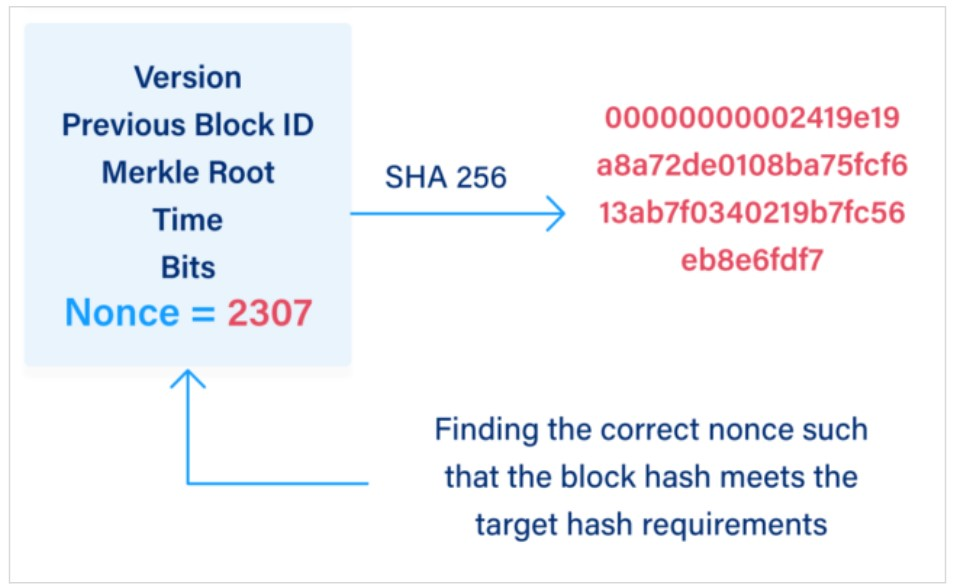

# Blockchain

This repository contains a piece of studies in blockchain technologies seen in [Blockchain A-Z: Build a Blockchain, a Crypto + ChatGPT Prize](https://www.superdatascience.com/pages/blockchain).


A blockchain is a continuosly growing list of records, called blocks, which are linked and secured using cryptography. The initial concept of blockchain comes from Stuart Haber and W. Scott Stornetta in 1991 by publishing a paper called [How to timestamp a digital document](https://link.springer.com/article/10.1007/BF00196791). Almost all of concepts, ideas and features are presented on that paper. 


The block in blockchain is where information is stored and encrypted. A block is constituted of `data`, `previous hash` and his own `hash`. Note that if anybody intent to change any block, the the fingerprint (hashs) will not matchup and the chain will be invalid. That is why blocks are cryptographically linked together.


### Hash cryptography (SHA-256)

Persons have fingerprints and different people have different fingerprints. There is a propability of two person with the same fingerprint but it is very unlikely. The probability of that is 1 in 60,000,000. So we can that a finger can be a identier of someone. That is something used by forensic departments in police. And if we could take the same principle applied to digital documents? A sort of fingerprint that indentifies a document that would identify documents for us.

```
SHA-2 (Secure Hash Algorithm 2) is a set of cryptographic hash functions designed by the United States National Security Agency (NSA) and first published in 2001. They are built using the Merkle–Damgård construction, from a one-way compression function itself built using the Davies–Meyer structure from a specialized block cipher.
```

There are five requirements for hash algorithms:

1. One-way: we cannot go 'backwards', so we cant get the hash and go back to the document.

2. Deterministc: the same document must produce **always** the same result.

3. Fast computation: need to be easy to reproduce in different scenarios.

4. Avalanche effect: a tiny little change in the document (even one bit) then the hash will be **absolutely** different.

5. Must withstand collisions: even though there is a lot of different variations in 256 bits, it still limited, its not infinite, then the hash algorithm need to deal with **artificial** collisions. 

### Immutable ledger

An immutable ledger is a record-keeping system where the data entered can't be altered, tampered with, or deleted. It ensures that all transactions or entries made in the ledger are permanently recorded and maintained in their original state, creating a transparent and trustworthy record of events. Lets say we have property  titles stored in a block in a blockchain. Then every time you need to do a transaction, you create a new block in the chain and if someone decides to take your title away by tampering with the data in the blockchain, he'll change the hash of the block, so all the blocks afterwards will no longer match the changed block.


### Distributed P2P Network

To prevent maliciously changes, inpur errors or accidents, P2P networks were implemented. This systems works in a lot of computers and they are all interconnected. So a blockchain is copied across all computers and they can proof themselves the validity of the blocks. So if somebody tries to maliciously attack and change a block, the others peers would see that their blockchain doesnt match and they would signal to the blockchain on the supecious computer to update the right one. So the majority of blockchains around it are in consensus and that means it will understand that its been hacked.

### How mining works

As discussed earlier, a block store few fields like data, previous hash and the actual hash. But thinking in the bitcoin context, why is need so many computation around the world dedicated to them? Basically there iinformationss antoher field in a block called `Nonce` (number used only once). This field is what mining is all about. Everybody is changing this field all the time.  We can change the hash field of the block by changing the nonce. By the way, the data, previous hash, nonce, and some other fields are the input of the hashing algorithm to generage the block hash. So every time you change (even a bit) for any of this fields, the actual hash of block will be completly different (as commented in the avalanche effect).


This nonce is used for change the hash number of a block in order to find the one that produces a hash with N leading zeros. Once we do generate such value, then we win and we are allowed to add the block to the blockchain properly. Taking into account of avalanche effect, find the right nonce to get this N leading zeros in the hash is hard because we need handle it using brute force, i.e, we need to try a lot of random nonces number and checks the produced hash one by one.



### Byzantine Fault Tolerance

Byzantine Fault Tolerance (BFT) is a property of a distributed system that allows it to function correctly even in the presence of faulty or malicious nodes. In the context of blockchain, BFT ensures that the consensus algorithm can reach agreement on the state of the blockchain, even if some nodes are behaving dishonestly. In a Byzantine fault-tolerant system, nodes communicate with each other to exchange information and reach a consensus on the validity of transactions and the order in which they should be added to the blockchain. This consensus is achieved through a consensus algorithm, such as Practical Byzantine Fault Tolerance (PBFT) or Proof of Stake (PoS).


The consensus algorithm ensures that a majority of honest nodes agree on the state of the blockchain. This means that even if a certain number of nodes are Byzantine, meaning they can behave arbitrarily and try to disrupt the consensus process, the honest nodes will still be able to reach agreement and maintain the integrity of the blockchain. To achieve Byzantine fault tolerance, the consensus algorithm typically involves multiple rounds of communication and voting among the nodes. Each node proposes a block or a set of transactions, and the other nodes validate and vote on the proposed block. Through a series of rounds, the nodes converge on a single block that is added to the blockchain.


Byzantine fault tolerance is crucial for the security and reliability of blockchain systems. It ensures that the blockchain remains secure and consistent, even in the presence of malicious actors or network failures. Without BFT, the blockchain would be vulnerable to attacks and could become unreliable or inconsistent.


# Cryptocurrency (Bitcoin)

Bitcoin is a protocol, i.e, a set of rules that guide how parcipants over network communicate with each other. 